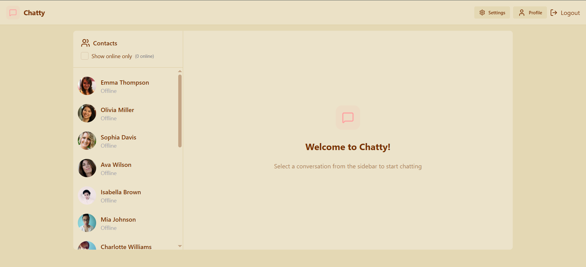

# ChatApp — MERN Chat Application

A realtime chat application built with MongoDB, Express, React (Vite), and Node.js. Includes user auth, direct messaging, Cloudinary image uploads and Socket.IO-powered realtime messaging.

## Demo / Screenshot



## Assets Gallery

The project includes UI assets used in the frontend. After moving assets into `Frontend/public/assets/`, these paths will render automatically on GitHub.

- Frontend/public/assets/hero.png
- Frontend/public/assets/login.png
- Frontend/public/assets/profile.png
- Frontend/public/assets/react.svg
- Frontend/public/assets/screenshot.png
- Frontend/public/assets/settings.png
- Frontend/public/assets/signup.png
- Frontend/public/assets/vite.svg

## Quick Start

Clone the repo and install dependencies for both backend and frontend.

```bash
git clone <your-repo-url>
cd ChatApp

# Backend
cd Backend
npm install

# Frontend
cd ../Frontend
npm install
```

## How to add or update assets

Place UI preview images in `Frontend/public/assets/` so they are served statically and render in the README using relative paths.

Example to add an image and commit:

```bash
# from repo root
git add Frontend/public/assets/my-image.png
git commit -m "Add UI preview image"
git push
```

## Environment variables

See `Backend/.env` and `Frontend/.env` examples in the project. Typical backend variables:

```
PORT=5000
MONGO_URI=your_mongo_connection_string
JWT_SECRET=your_jwt_secret
CLOUDINARY_CLOUD_NAME=your_cloud_name
CLOUDINARY_API_KEY=your_api_key
CLOUDINARY_API_SECRET=your_api_secret
CLIENT_URL=http://localhost:5173
```

Frontend (Vite) example in `Frontend/.env`:

```
VITE_API_URL=http://localhost:5000/api
```

## Running locally

1. Start MongoDB (local or Atlas)
2. `cd Backend && npm run dev`
3. `cd Frontend && npm run dev`
4. Open `http://localhost:5173`

## Contributing

Fork, create a branch, add tests, and open a pull request.

---

If you'd like I can also add a `.github/workflows` CI workflow to run lint/tests on pull requests.
